# 9BizClaw — Super System Architecture Diagram

> Open `system-architecture.html` in your browser to view this as an interactive diagram with zoom, pan, and search.

## What follows is the Mermaid source — the HTML file has it embedded.

```mermaid
flowchart TB
    subgraph ELECTRON_APP["ELECTRON APP (main.js)"]
        BOOT["boot.js<br/>Runtime Installer<br/>Vendor Detection<br/>CLI Shims<br/>Window Management"]
        GATEWAY["gateway.js<br/>Fast Watchdog (20s)<br/>Channel Supervisor<br/>IPC Router"]
        CONFIG["config.js<br/>9Router Config<br/>Model Defaults<br/>Runtime Patches"]
        WORKSPACE["workspace.js<br/>Template Seeding<br/>Skill Registry<br/>Audit Log"]
    end

    subgraph CHANNELS["CHANNELS (modoro-zalo plugin)"]
        ZALO_PLUGIN["modoro-zalo plugin<br/>(electron/packages/modoro-zalo)"]
        ZCA["openzca CLI<br/>Zalo Cookie Auth<br/>Message Listener + Sender"]
        INBOUND["inbound.ts<br/>Defense Middleware<br/>Stranger Policy<br/>Deduplication<br/>Skill Injection"]
        SEND["send.ts<br/>Zalo Safe Sender<br/>Media Upload<br/>Sensitive Path Filter"]
        CHANNEL_TS["channel.ts<br/>ZaloListener Lifecycle<br/>Start/Stop/Restart"]
    end

    subgraph BRAIN["BRAIN (AI Processing)"]
        NINE_ROUTER["nine-router.js<br/>9Router Process Manager<br/>Provider Key Sync<br/>Model Routing<br/>API Key Management"]
        OPENCLAW["openclaw CLI<br/>Agent Runtime<br/>Session Management<br/>Tool Execution"]
        PROMPT_BUILDER["Prompt Builder<br/>Identity + Soul<br/>Bootstrap Context<br/>Skill Injection<br/>Memory Context<br/>Tool Definitions"]
        SKILL_MANAGER["skill-manager.js<br/>User Skills Registry<br/>Shipped Domain Skills<br/>Lazy Trigger Matching<br/>Scope Filtering<br/>Conflict Detection"]
        SKILL_RUNNER["skill-runner.js<br/>Python Runtime<br/>Script Execution<br/>Timeout + Kill"]
        EMBEDDER["embedder.js<br/>E5 Multilingual Embeddings<br/>Vector DB (better-sqlite3)<br/>Hybrid Search (FTS5 + Vector)"]
    end

    subgraph MEMORY["MEMORY SYSTEM"]
        CEO_MEMORY["ceo-memory.js<br/>SQLite (better-sqlite3)<br/>CEO Memory DB<br/>Long-term Context"]
        CEO_CAPTURE["ceo-memory-capture.js<br/>Session Summarization<br/>Sanitize LLM Output<br/>Prompt Injection Defense"]
        ZALO_MEMORY["zalo-memory.js<br/>Per-customer Memory<br/>Conversation Summaries<br/>Per-customer Summaries"]
        CONVERSATION["conversation.js<br/>Session JSONL Reader<br/>Daily Memory Journal<br/>Customer Memory Files"]
        KNOWLEDGE["knowledge.js<br/>Knowledge Base<br/>Vector Search<br/>FTS5 Search<br/>CRUD + Visibility"]
        MEDIA_LIBRARY["media-library.js<br/>Brand Assets<br/>Image Storage<br/>Audience Visibility"]
    end

    subgraph CRON["CRON / SCHEDULER"]
        CRON_ENGINE["cron.js<br/>Schedule Engine<br/>CRON_AGENT_TIMEOUT (10min)<br/>Retry + Backoff<br/>Zalo Pause Check"]
        CRON_API["cron-api.js<br/>REST API<br/>CRON Token Auth<br/>Bearer 48-hex<br/>Default Deny"]
        FB_SCHEDULE["fb-schedule.js<br/>Facebook Scheduler<br/>Approve/Regenerate<br/>Telegram Commands"]
        FOLLOWUP["follow-up.js<br/>Pending Reply Scanner<br/>Promise Detection<br/>CEO Nudge"]
    end

    subgraph INTEGRATIONS["INTEGRATIONS"]
        GOOGLE["google-api.js<br/>Gmail Inbox<br/>Calendar Events<br/>Sheets CRUD<br/>Drive Files<br/>Docs/Contacts/Tasks"]
        IMAGE_GEN["image-gen.js<br/>Local Image Gen<br/>Brand-aware<br/>9Router Route"]
        FB_PUBLISHER["fb-publisher.js<br/>Facebook Graph API<br/>Page Insights<br/>Post Publishing"]
        INVENTORY["inventory-manager.js<br/>Stock Tracking<br/>Alert Thresholds"]
        LEAVE["leave-manager.js<br/>Request/Approve<br/>Summary API"]
        ORDER["order-manager.js<br/>Order CRUD<br/>Status Tracking"]
    end

    subgraph DASHBOARD["DASHBOARD (renderer)"]
        DASHBOARD_HTML["dashboard.html<br/>18 Pages<br/>SPA with routing"]
        DASHBOARD_IPC["dashboard-ipc.js<br/>211 IPC Handlers<br/>204 Preload Bridges"]
        PRELOAD["preload.js<br/>Context Bridge<br/>API Exposure"]
        ZALO_MENU["zalo-menu.js<br/>Zalo Settings UI<br/>Account Management"]
    end

    subgraph WORKSPACE_TEMPLATES["WORKSPACE TEMPLATE (seeded at first run)"]
        AGENTS["AGENTS.md<br/>Task Routing Rules<br/>Context Split"]
        IDENTITY["IDENTITY.md<br/>Company Identity<br/>Products & Services"]
        SOUL["SOUL.md<br/>Bot Personality<br/>Communication Style"]
        BOOTSTRAP["BOOTSTRAP.md<br/>Onboarding Flow"]
        COMPANY["COMPANY.md<br/>Business Context"]
        USER["USER.md<br/>CEO Profile"]
        MEMORY_DIR["memory/<br/>customer memories<br/>zalo-users/"]
        SKILLS_DIR["skills/<br/>anthropic-docx<br/>anthropic-pptx<br/>anthropic-xlsx<br/>anthropic-pdf<br/>shipped/"]
        USER_SKILLS["user-skills/<br/>_registry.json<br/>{id}/SKILL.md"]
        TOOLS["tools/<br/>security/<br/>memory-db/"]
        LOGS["logs/<br/>audit.jsonl<br/>cron-runs.jsonl"]
    end

    subgraph VENDOR["VENDOR BUNDLE (runtime install)"]
        VENDOR_NODE["Node.js 22.22.2"]
        VENDOR_OPENCLAW["openclaw@2026.4.14"]
        VENDOR_9ROUTER["9router@0.4.63"]
        VENDOR_OPENZCA["openzca@0.1.59"]
        VENDOR_MODELS["Xenova/multilingual-e5-small<br/>(embedding model)"]
    end

    %% ELECTRON → CHANNELS
    BOOT --> GATEWAY
    GATEWAY --> CHANNEL_TS
    CHANNEL_TS --> ZCA
    CHANNEL_TS --> INBOUND
    INBOUND --> SEND

    %% INBOUND → BRAIN
    INBOUND --> NINE_ROUTER
    INBOUND --> SKILL_MANAGER
    SKILL_MANAGER --> SKILL_RUNNER
    INBOUND --> EMBEDDER
    INBOUND --> KNOWLEDGE

    %% NINE_ROUTER → OPENCLAW
    NINE_ROUTER --> OPENCLAW
    NINE_ROUTER --> VENDOR_NODE
    NINE_ROUTER --> VENDOR_9ROUTER

    %% BRAIN → MEMORY
    OPENCLAW --> CEO_MEMORY
    OPENCLAW --> CEO_CAPTURE
    OPENCLAW --> ZALO_MEMORY
    OPENCLAW --> CONVERSATION
    OPENCLAW --> KNOWLEDGE
    OPENCLAW --> MEDIA_LIBRARY
    OPENCLAW --> SKILL_RUNNER

    %% CRON
    CRON_ENGINE --> CRON_API
    CRON_ENGINE --> NINE_ROUTER
    CRON_ENGINE --> CONVERSATION
    CRON_ENGINE --> FOLLOWUP
    CRON_ENGINE --> FB_SCHEDULE
    CRON_ENGINE --> GOOGLE
    CRON_ENGINE --> IMAGE_GEN
    CRON_ENGINE --> ZALO_MEMORY
    CRON_ENGINE --> CEO_MEMORY

    %% INTEGRATIONS
    GOOGLE --> NINE_ROUTER
    IMAGE_GEN --> NINE_ROUTER
    FB_PUBLISHER --> NINE_ROUTER

    %% DASHBOARD
    DASHBOARD_HTML --> PRELOAD
    PRELOAD --> DASHBOARD_IPC
    DASHBOARD_IPC --> BOOT
    DASHBOARD_IPC --> GATEWAY
    DASHBOARD_IPC --> CONFIG
    DASHBOARD_IPC --> CHANNELS
    DASHBOARD_IPC --> SKILL_MANAGER
    DASHBOARD_IPC --> KNOWLEDGE
    DASHBOARD_IPC --> MEDIA_LIBRARY
    DASHBOARD_IPC --> CRON_API
    DASHBOARD_IPC --> GOOGLE
    DASHBOARD_IPC --> FB_SCHEDULE
    DASHBOARD_IPC --> ZALO_MENU

    %% WORKSPACE SEEDING
    WORKSPACE --> AGENTS
    WORKSPACE --> IDENTITY
    WORKSPACE --> SOUL
    WORKSPACE --> BOOTSTRAP
    WORKSPACE --> COMPANY
    WORKSPACE --> USER
    WORKSPACE --> MEMORY_DIR
    WORKSPACE --> SKILLS_DIR
    WORKSPACE --> USER_SKILLS
    WORKSPACE --> TOOLS
    WORKSPACE --> LOGS
    WORKSPACE --> SKILL_MANAGER

    %% SKILL_MANAGER ↔ USER_SKILLS + SHIPPED
    SKILL_MANAGER --> USER_SKILLS
    SKILL_MANAGER --> SKILLS_DIR

    %% VENDOR
    BOOT --> VENDOR_NODE
    GATEWAY --> VENDOR_OPENCLAW
    GATEWAY --> VENDOR_9ROUTER
    GATEWAY --> VENDOR_OPENZCA
    EMBEDDER --> VENDOR_MODELS

    %% CONFIG feeds everything
    CONFIG --> NINE_ROUTER
    CONFIG --> OPENCLAW
    CONFIG --> GATEWAY
    CONFIG --> WORKSPACE
```

